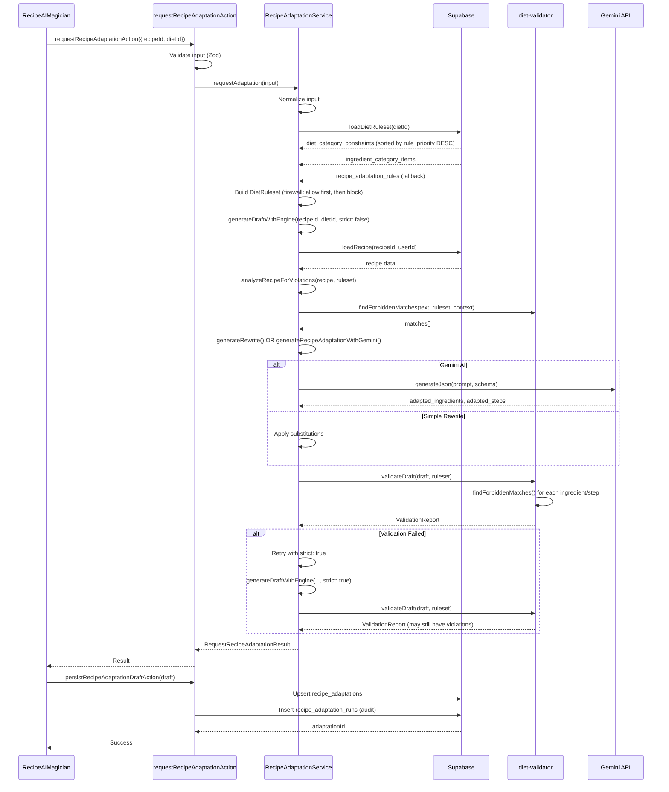
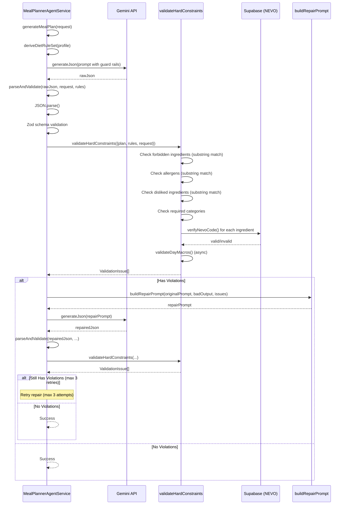

# Guard Rails Systeem - AS-IS Inventarisatie

**Document versie**: 1.0  
**Datum**: 2026-01-26  
**Doel**: Complete inventarisatie van het huidige guard rails systeem voor herbouw zonder regressies

---

## 1. Entry Points

### 1.1 Recipe Adaptation Flow

**Primary Entry Point**: `requestRecipeAdaptationAction`

- **File**: `src/app/(app)/recipes/[recipeId]/actions/recipe-ai.actions.ts`
- **Function**: `requestRecipeAdaptationAction(raw: unknown)`
- **Validatie**: Zod schema (`requestRecipeAdaptationInputSchema`)
- **Flow**:
  1. Valideert input (recipeId, dietId, locale)
  2. Roept `RecipeAdaptationService.requestAdaptation()` aan
  3. Retourneert `RequestRecipeAdaptationResult` (discriminated union)

**Service Entry Point**: `RecipeAdaptationService.requestAdaptation()`

- **File**: `src/app/(app)/recipes/[recipeId]/services/recipe-adaptation.service.ts`
- **Function**: `async requestAdaptation(input: RequestRecipeAdaptationInput)`
- **Flow**:
  1. Normaliseert input (trim, validatie)
  2. Laadt diet ruleset via `loadDietRuleset(dietId)`
  3. Genereert draft via `generateDraftWithEngine(recipeId, dietId, strict: boolean)`
  4. Valideert draft via `validateDraft(draft, ruleset)`
  5. Retry logica: als validatie faalt, retry met `strict: true`
  6. Retourneert `RequestRecipeAdaptationResult`

**UI Entry Point**: `RecipeAIMagician` component

- **File**: `src/app/(app)/recipes/[recipeId]/components/RecipeAIMagician.tsx`
- **Function**: `handleStartAnalysis()`
- **Flow**:
  1. Haalt huidige dietId op via `getCurrentDietIdAction()`
  2. Roept `requestRecipeAdaptationAction()` aan
  3. Persisteert result via `persistRecipeAdaptationDraftAction()`

### 1.2 Meal Planner Flow

**Primary Entry Point**: `MealPlannerAgentService.generateMealPlan()`

- **File**: `src/lib/agents/meal-planner/mealPlannerAgent.service.ts`
- **Function**: `async generateMealPlan(request: MealPlanRequest)`
- **Guard Rails Loading**:
  - Laadt `DietProfile` uit database
  - Deriveert `DietRuleSet` via `deriveDietRuleSet(profile)` (zie `src/lib/diets/diet-rules.ts`)
  - **BELANGRIJK**: Guard rails worden **altijd** afgeleid van `DietProfile`, nooit geaccepteerd als input

**Validation Entry Point**: `validateHardConstraints()`

- **File**: `src/lib/agents/meal-planner/mealPlannerAgent.validate.ts`
- **Function**: `async validateHardConstraints(args: { plan, rules, request })`
- **Validatie**:
  - Forbidden ingredients (via `isForbiddenIngredient()`)
  - Allergens (via `isAllergen()`)
  - Disliked ingredients (via `isDisliked()`)
  - Missing required categories (via `checkRequiredCategories()`)
  - Invalid NEVO codes (via `validateNevoCodes()`)
  - Macro/calorie target violations (via `validateDayMacros()`)

### 1.3 Plan Chat Flow

**Entry Point**: `PlanChatService.processMessage()`

- **File**: `src/lib/agents/meal-planner/planChat.service.ts`
- **Function**: `async processMessage(args)`
- **Guard Rails Integration**:
  - Bouwt `guardrailsSummary` string uit allergies, dislikes, maxPrep
  - Voegt toe aan prompt via `buildPlanChatPrompt()` (zie `src/lib/agents/meal-planner/planChat.prompts.ts`)

---

## 2. Canonical Model

### 2.1 DietRuleset (Recipe Adaptation)

**Type Definition**: `src/app/(app)/recipes/[recipeId]/services/diet-validator.ts`

```typescript
type DietRuleset = {
  dietId: string;
  version: number;
  forbidden: Array<{
    term: string; // Lowercase term (e.g., "pasta")
    synonyms?: string[]; // Lowercase synonyms (e.g., ["spaghetti", "penne"])
    ruleCode: string; // "GUARD_RAIL_HARD" | "GUARD_RAIL_SOFT" | "LOW_SUGAR" | etc.
    ruleLabel: string; // Human-readable label (e.g., "Glutenhoudende granen (Strikt verboden)")
    substitutionSuggestions?: string[]; // Suggested replacements
  }>;
  heuristics?: {
    addedSugarTerms: string[]; // For added sugar detection in steps
  };
};
```

**Essentiële velden**:

- `dietId`: UUID van diet_types tabel
- `forbidden[].term`: Primary matching term (lowercase)
- `forbidden[].synonyms`: Alternatieve termen voor matching
- `forbidden[].ruleCode`: Determines strictness ("GUARD_RAIL_HARD" = hard, "GUARD_RAIL_SOFT" = soft)
- `heuristics.addedSugarTerms`: Woordenlijst voor added sugar detection

### 2.2 DietRuleSet (Meal Planner)

**Type Definition**: `src/lib/diets/diet.types.ts`

```typescript
type DietRuleSet = {
  dietKey: DietKey;
  ingredientConstraints: IngredientConstraint[];
  requiredCategories: RequiredCategoryConstraint[];
  perMealConstraints: PerMealConstraint[];
  weeklyVariety: WeeklyVarietyConstraint;
  macroConstraints: MacroConstraint[];
  mealStructure: MealStructureConstraint[];
  calorieTarget: { min?: number; max?: number; target?: number };
  prepTimeConstraints: {
    globalMax?: number;
    perMeal?: PrepTimePreference;
    batchCooking?: BatchCookingPreference;
  };
  budgetConstraints?: BudgetPreference;
  pantryUsage?: PantryPreference;
};
```

**Essentiële velden**:

- `ingredientConstraints[].type`: "allowed" | "forbidden"
- `ingredientConstraints[].items`: Specifieke ingredient names
- `ingredientConstraints[].categories`: Category codes (e.g., ["grains", "dairy"])
- `ingredientConstraints[].constraintType`: "hard" | "soft"
- `requiredCategories[].category`: Category code
- `requiredCategories[].minPerDay` / `minPerWeek`: Minimum requirements

### 2.3 ValidationReport (Recipe Adaptation)

**Type Definition**: `src/app/(app)/recipes/[recipeId]/services/diet-validator.ts`

```typescript
type ValidationReport = {
  ok: boolean; // true = geen violations
  matches: Array<{
    term: string; // Forbidden term that matched
    matched: string; // Actual text that matched
    where: 'ingredients' | 'steps'; // Location of match
    ruleCode?: string; // Rule code
    ruleLabel?: string; // Rule label
    substitutionSuggestions?: string[]; // Suggestions
  }>;
  summary: string; // Human-readable summary
};
```

### 2.4 RequestRecipeAdaptationResult

**Type Definition**: `src/app/(app)/recipes/[recipeId]/recipe-ai.types.ts`

```typescript
type RequestRecipeAdaptationResult =
  | { outcome: "success"; adaptation: RecipeAdaptationDraft; meta: {...} }
  | { outcome: "empty"; reason: "NO_DIET_SELECTED" }
  | { outcome: "error"; message: string; code: "INVALID_INPUT" | "INTERNAL_ERROR" };
```

---

## 3. Rules Storage

### 3.1 Database Tabellen

#### 3.1.1 `diet_category_constraints` (Primary Source)

**Migration**: `supabase/migrations/20260131000006_ingredient_categories.sql`  
**Firewall Update**: `supabase/migrations/20260131000007_firewall_rules.sql`

**Schema**:

```sql
CREATE TABLE diet_category_constraints (
  id UUID PRIMARY KEY,
  diet_type_id UUID REFERENCES diet_types(id) ON DELETE CASCADE,
  category_id UUID REFERENCES ingredient_categories(id) ON DELETE CASCADE,
  constraint_type TEXT CHECK (constraint_type IN ('forbidden', 'required')), -- Legacy
  rule_action TEXT CHECK (rule_action IN ('allow', 'block')), -- New firewall field
  strictness TEXT CHECK (strictness IN ('hard', 'soft')) DEFAULT 'hard',
  priority INTEGER DEFAULT 50, -- Legacy
  rule_priority INTEGER DEFAULT 50, -- New firewall field (used for sorting)
  min_per_day INTEGER, -- For required categories
  min_per_week INTEGER, -- For required categories
  is_active BOOLEAN DEFAULT true,
  created_at TIMESTAMPTZ DEFAULT NOW(),
  updated_at TIMESTAMPTZ DEFAULT NOW(),
  UNIQUE(diet_type_id, category_id, rule_action) -- Allows both allow and block for same category
);
```

**Indexes**:

- `idx_diet_category_constraints_rule_priority`: `(diet_type_id, rule_priority DESC, is_active)`
- `idx_diet_category_constraints_diet_type_id`
- `idx_diet_category_constraints_category_id`
- `idx_diet_category_constraints_type`
- `idx_diet_category_constraints_active`

**RLS Policies**:

- **SELECT**: Public kan alleen actieve constraints lezen (`is_active = true`)
- **ALL**: Admins kunnen alles beheren (via `is_admin(auth.uid())`)

**Gebruik**:

- **Recipe Adaptation**: `RecipeAdaptationService.loadDietRuleset()` laadt constraints gesorteerd op `rule_priority DESC`
- **Firewall Logica**:
  1. Eerst verzamelen allow regels (voor tracking)
  2. Dan verzamelen block regels (block heeft voorrang)
  3. Block regels met hogere prioriteit kunnen allow overrulen

#### 3.1.2 `ingredient_categories` (Master Categories)

**Migration**: `supabase/migrations/20260131000006_ingredient_categories.sql`

**Schema**:

```sql
CREATE TABLE ingredient_categories (
  id UUID PRIMARY KEY,
  code TEXT UNIQUE NOT NULL, -- e.g., "dairy", "gluten_containing_grains"
  name_nl TEXT NOT NULL,
  name_en TEXT,
  description TEXT,
  category_type TEXT CHECK (category_type IN ('forbidden', 'required')), -- Static per category
  parent_category_id UUID REFERENCES ingredient_categories(id),
  display_order INTEGER DEFAULT 0,
  is_active BOOLEAN DEFAULT true,
  created_at TIMESTAMPTZ DEFAULT NOW(),
  updated_at TIMESTAMPTZ DEFAULT NOW()
);
```

**Seed Data**: Basis categorieën worden geïnitialiseerd in migration:

- Forbidden: `dairy`, `gluten_containing_grains`, `legumes`, `nightshades`, `processed_sugar`, `nuts`, `eggs`, `shellfish`, `alcohol`
- Required: `leafy_vegetables`, `sulfur_vegetables`, `colored_vegetables`, `organ_meats`, `seaweed`, `fermented_foods`

#### 3.1.3 `ingredient_category_items` (Specific Terms)

**Migration**: `supabase/migrations/20260131000006_ingredient_categories.sql`

**Schema**:

```sql
CREATE TABLE ingredient_category_items (
  id UUID PRIMARY KEY,
  category_id UUID REFERENCES ingredient_categories(id) ON DELETE CASCADE,
  term TEXT NOT NULL, -- e.g., "pasta", "orzo"
  term_nl TEXT,
  synonyms JSONB DEFAULT '[]'::jsonb, -- Array of strings
  display_order INTEGER DEFAULT 0,
  is_active BOOLEAN DEFAULT true,
  created_at TIMESTAMPTZ DEFAULT NOW(),
  updated_at TIMESTAMPTZ DEFAULT NOW(),
  UNIQUE(category_id, term)
);
```

**Voorbeeld Data**:

- Category: `gluten_containing_grains`
  - Term: `pasta`, synonyms: `["spaghetti", "penne", "fusilli", "macaroni", "orzo", ...]`
  - Term: `wheat`, synonyms: `["tarwe", "tarwebloem", "tarwemeel", "bloem", "meel"]`

#### 3.1.4 `recipe_adaptation_rules` (Legacy/Additional Rules)

**Migration**: `supabase/migrations/20260131000005_recipe_adaptation_rules.sql`

**Schema**:

```sql
CREATE TABLE recipe_adaptation_rules (
  id UUID PRIMARY KEY,
  diet_type_id UUID REFERENCES diet_types(id) ON DELETE CASCADE,
  term TEXT NOT NULL,
  synonyms JSONB DEFAULT '[]'::jsonb,
  rule_code TEXT NOT NULL, -- e.g., "GLUTEN_FREE", "LACTOSE_FREE"
  rule_label TEXT NOT NULL,
  substitution_suggestions JSONB DEFAULT '[]'::jsonb,
  priority INTEGER DEFAULT 50,
  is_active BOOLEAN DEFAULT true,
  created_at TIMESTAMPTZ DEFAULT NOW(),
  updated_at TIMESTAMPTZ DEFAULT NOW(),
  UNIQUE(diet_type_id, term)
);
```

**Gebruik**:

- **Fallback**: Als `diet_category_constraints` leeg is, wordt deze tabel gebruikt
- **Merging**: In `RecipeAdaptationService.loadDietRuleset()` worden rules uit deze tabel **toegevoegd** aan rules uit `diet_category_constraints` (PRIORITY 2)

#### 3.1.5 `recipe_adaptation_heuristics` (Heuristics)

**Migration**: `supabase/migrations/20260131000005_recipe_adaptation_rules.sql`

**Schema**:

```sql
CREATE TABLE recipe_adaptation_heuristics (
  id UUID PRIMARY KEY,
  diet_type_id UUID REFERENCES diet_types(id) ON DELETE CASCADE,
  heuristic_type TEXT NOT NULL, -- e.g., "added_sugar"
  terms JSONB DEFAULT '[]'::jsonb, -- Array of strings
  is_active BOOLEAN DEFAULT true,
  created_at TIMESTAMPTZ DEFAULT NOW(),
  updated_at TIMESTAMPTZ DEFAULT NOW()
);
```

**Gebruik**:

- Voor added sugar detection in recipe steps
- Wordt geladen in `RecipeAdaptationService.loadDietRuleset()` en toegevoegd aan `DietRuleset.heuristics.addedSugarTerms`

### 3.2 Code-Based Rules (Meal Planner)

**File**: `src/lib/diets/diet-rules.ts`

**Functie**: `deriveDietRuleSet(profile: DietProfile): DietRuleSet`

**Regels**:

- **Hardcoded per diet**: Elke diet heeft eigen builder functie (e.g., `buildWahlsPaleoPlusRuleSet()`, `buildKetoRuleSet()`)
- **User allergies/dislikes**: Worden toegevoegd als `ingredientConstraints` met `constraintType: "hard"` (allergies) of `"soft"` (dislikes)
- **Category expansion**: Categories worden uitgebreid via `INGREDIENT_CATEGORY_MAP` (zie `src/lib/diet-validation/ingredient-categorizer.ts`)

**Voorbeeld** (Wahls Paleo Plus):

```typescript
ingredientConstraints: [
  {
    type: 'forbidden',
    items: [],
    categories: ['grains', 'dairy', 'legumes', 'processed_sugar'],
    constraintType: 'hard',
  },
  // User allergies added dynamically
  ...(profile.allergies.length > 0
    ? [{ type: 'forbidden', items: profile.allergies, constraintType: 'hard' }]
    : []),
];
```

### 3.3 Fallback Ruleset

**File**: `src/app/(app)/recipes/[recipeId]/services/recipe-adaptation.service.ts`  
**Function**: `getFallbackRuleset(dietId: string): DietRuleset`

**Hardcoded fallback** als alle database queries falen:

- `pasta` (met synonyms: spaghetti, penne, etc.)
- `tarwebloem` (met synonyms: tarwe, wheat, bloem, meel)
- `melk` (met synonyms: koemelk, volle melk, etc.)
- `suiker` (met synonyms: rietsuiker, witte suiker, etc.)

**Gebruik**: Wordt gebruikt als:

1. `diet_category_constraints` leeg is
2. `recipe_adaptation_rules` leeg is
3. Profile derivation faalt
4. User niet geauthenticeerd is

---

## 4. Evaluation Semantics

### 4.1 Recipe Adaptation Validation

**File**: `src/app/(app)/recipes/[recipeId]/services/diet-validator.ts`  
**Function**: `validateDraft(draft: RecipeAdaptationDraft, ruleset: DietRuleset): ValidationReport`

#### 4.1.1 Matching Logic

**Function**: `findForbiddenMatches(text: string, ruleset: DietRuleset, context: "ingredients" | "steps")`

**Matching Strategie** (in volgorde van prioriteit):

1. **Exact Match (ingredients only)**:
   - Check exact match met main term (lowercase)
   - Check exact match met synonyms (lowercase)
   - **Stopt bij eerste match** per forbidden term

2. **Word Boundary Match**:
   - Regex: `\b${escapedTerm}\b` (case-insensitive)
   - Voorkomt false positives (e.g., "suikervrij" matcht niet op "suiker")
   - Werkt voor zowel main term als synonyms

3. **Substring Match (ingredients only, fallback)**:
   - `text.toLowerCase().includes(term.toLowerCase())`
   - Gebruikt als word boundary geen match geeft
   - **Risico**: Kan false positives geven (e.g., "pasta" in "pastasaus")

4. **Added Sugar Heuristics (steps only)**:
   - Alleen in `context === "steps"`
   - Word boundary matching op `ruleset.heuristics.addedSugarTerms`
   - Alleen als term niet al gematcht is door forbidden rules

**Matching Context**:

- **Ingredients**: Check `ingredient.name` en `ingredient.note` (als aanwezig)
- **Steps**: Check `step.text` (volledige step tekst)

#### 4.1.2 Priority & Overrides

**Firewall Evaluatie** (in `RecipeAdaptationService.loadDietRuleset()`):

1. **Sortering**: Constraints worden geladen gesorteerd op `rule_priority DESC` (hoog naar laag)
2. **Allow Rules**: Eerst verzameld in `allowedTerms` Set (voor tracking)
3. **Block Rules**: Daarna verzameld in `forbidden[]` array
4. **Conflict Resolution**:
   - Als term in `allowedTerms` staat maar ook in block regel met hogere prioriteit: **block wint**
   - **Eerste match wint**: Validator gebruikt eerste match in `forbidden[]` array (geen verdere evaluatie)

**Strictness**:

- `strictness === "hard"` → `ruleCode: "GUARD_RAIL_HARD"`
- `strictness === "soft"` → `ruleCode: "GUARD_RAIL_SOFT"`
- **Huidige implementatie**: Strictness wordt alleen gebruikt voor labeling, niet voor evaluatie logica

#### 4.1.3 Default Behavior

**Als geen match**:

- `ValidationReport.ok = true`
- `ValidationReport.matches = []`
- `ValidationReport.summary = "No forbidden ingredients detected"`

**Als match gevonden**:

- `ValidationReport.ok = false`
- `ValidationReport.matches` bevat alle matches (kan meerdere zijn per ingredient/step)
- `ValidationReport.summary = "${count} forbidden term(s) detected (${uniqueCount} unique rule(s))"`

### 4.2 Meal Planner Validation

**File**: `src/lib/agents/meal-planner/mealPlannerAgent.validate.ts`  
**Function**: `validateHardConstraints(args: { plan, rules, request }): Promise<ValidationIssue[]>`

#### 4.2.1 Matching Logic

**Function**: `matchesIngredient(ingredientName: string, searchTerm: string): boolean`

**Matching Strategie**:

- **Case-insensitive substring match**: `ingredientName.toLowerCase().includes(searchTerm.toLowerCase())`
- **Tag-based matching**: Check `ingredient.tags` array voor category matches
- **Geen word boundary**: Kan false positives geven

#### 4.2.2 Priority & Overrides

**Rule Evaluation**:

- Rules worden gesorteerd op `priority` (higher = stricter) in `validateRecipeAgainstDiet()` (zie `src/lib/diet-validation/validation-engine.ts`)
- **Eerste match wint**: Validatie stopt bij eerste violation per ingredient
- **Hard vs Soft**:
  - Hard constraints: `constraintType === "hard"` → `ValidationIssue.code = "FORBIDDEN_INGREDIENT"`
  - Soft constraints: Worden niet gecheckt in `validateHardConstraints()` (alleen hard constraints)

#### 4.2.3 Default Behavior

**Als geen violations**:

- Retourneert lege array `[]`
- Plan wordt geaccepteerd

**Als violations gevonden**:

- Retourneert array van `ValidationIssue[]`
- Elke issue heeft `path`, `code`, `message`
- Plan wordt **niet** geaccepteerd (repair flow wordt getriggerd)

---

## 5. Decision Outputs

### 5.1 Recipe Adaptation Outputs

#### 5.1.1 RequestRecipeAdaptationResult

**Success Case**:

```typescript
{
  outcome: "success",
  adaptation: RecipeAdaptationDraft,
  meta: {
    timestamp: string,
    recipeId: string,
    dietId: string,
    locale?: string
  }
}
```

**Empty Case**:

```typescript
{
  outcome: "empty",
  reason: "NO_DIET_SELECTED"
}
```

**Error Cases**:

```typescript
{
  outcome: "error",
  message: string, // Human-readable error message
  code: "INVALID_INPUT" | "INTERNAL_ERROR"
}
```

**Error Codes**:

- `INVALID_INPUT`: recipeId ontbreekt of ongeldig, dietId niet gevonden
- `INTERNAL_ERROR`: Onverwachte fout in service (e.g., Gemini API failure, database error)

#### 5.1.2 ValidationReport

**Success**:

```typescript
{
  ok: true,
  matches: [],
  summary: "No forbidden ingredients detected"
}
```

**Failure**:

```typescript
{
  ok: false,
  matches: [
    {
      term: "pasta",
      matched: "spaghetti",
      where: "ingredients",
      ruleCode: "GUARD_RAIL_HARD",
      ruleLabel: "Glutenhoudende granen (Strikt verboden)",
      substitutionSuggestions: ["rijstnoedels", "zucchininoedels"]
    }
  ],
  summary: "1 forbidden term detected (1 unique rule)"
}
```

### 5.2 Meal Planner Outputs

#### 5.2.1 ValidationIssue

**Format**:

```typescript
{
  path: string, // e.g., "days[0].meals[0].ingredientRefs[2]"
  code: "FORBIDDEN_INGREDIENT" | "ALLERGEN_PRESENT" | "DISLIKED_INGREDIENT" |
        "MISSING_REQUIRED_CATEGORY" | "INVALID_NEVO_CODE" |
        "CALORIE_TARGET_MISS" | "MACRO_TARGET_MISS" | "MEAL_PREFERENCE_MISS",
  message: string // Human-readable error message
}
```

**Codes**:

- `FORBIDDEN_INGREDIENT`: Ingredient verboden door diet rules
- `ALLERGEN_PRESENT`: Ingredient matcht user allergy
- `DISLIKED_INGREDIENT`: Ingredient in user's dislikes list
- `MISSING_REQUIRED_CATEGORY`: Required category niet gevonden in day
- `INVALID_NEVO_CODE`: NEVO code bestaat niet in database
- `CALORIE_TARGET_MISS`: Day calories buiten hard target range
- `MACRO_TARGET_MISS`: Day macros buiten hard target range
- `MEAL_PREFERENCE_MISS`: Meal preference niet voldaan

---

## 6. AI Integration

### 6.1 Recipe Adaptation AI Integration

**File**: `src/app/(app)/recipes/[recipeId]/services/gemini-recipe-adaptation.service.ts`  
**Function**: `generateRecipeAdaptationWithGemini(recipe, violations, ruleset, dietName)`

#### 6.1.1 Prompt Construction

**Function**: `buildAdaptationPrompt(recipe, violations, ruleset, dietName)`

**Guard Rails in Prompt**:

```typescript
const forbiddenTerms = ruleset.forbidden
  .map(
    (r) =>
      `${r.term}${r.synonyms ? ` (synoniemen: ${r.synonyms.join(', ')})` : ''}`,
  )
  .join(', ');

// In prompt:
`DIET INFORMATIE:
Dieet: ${dietName}
Verboden ingrediënten: ${forbiddenTerms}

GEDETECTEERDE AFWIJKINGEN:
${violationsList}

BELANGRIJKE REGELS:
- Alle verboden ingrediënten MOETEN worden vervangen
- De aangepaste versie moet volledig dieet-compatibel zijn`;
```

**Fail Behavior**:

- **Fail-Open**: Als Gemini API faalt, valt terug op `generateRewrite()` (simple substitution)
- **Geen hard enforcement**: AI output wordt **niet** automatisch geblokkeerd als violations gevonden worden
- **Post-validation**: Draft wordt gevalideerd via `validateDraft()`, maar violations worden **toch** geretourneerd aan user (met warning)

#### 6.1.2 Retry Logic

**File**: `src/app/(app)/recipes/[recipeId]/services/recipe-adaptation.service.ts`

**Flow**:

1. Eerste poging: `generateDraftWithEngine(recipeId, dietId, strict: false)`
2. Validatie: `validateDraft(draft, ruleset)`
3. Als `!validation.ok`: Retry met `strict: true`
4. In strict mode: Gebruikt **alle** forbidden terms uit ruleset (niet alleen gevonden violations)
5. Als retry ook violations heeft: **Toch retourneren** (met warning in console)

**Fail Behavior**:

- **Fail-Open**: Draft wordt altijd geretourneerd, zelfs met violations
- **User ziet violations**: UI toont violations in `draft.analysis.violations`

### 6.2 Meal Planner AI Integration

**File**: `src/lib/agents/meal-planner/mealPlannerAgent.prompts.ts`

#### 6.2.1 Prompt Construction

**Function**: `buildMealPlanPrompt(input: { request, rules, candidates, language })`

**Guard Rails in Prompt**:

```typescript
// Constraints worden geformatteerd als text
const constraintSummary = formatConstraints(rules);

// In prompt:
`DIET RULES & CONSTRAINTS:
${constraintSummary}

CRITICAL REQUIREMENTS:
1. Output MUST be exactly ONE valid JSON object conforming to the provided schema
2. All HARD constraints must be followed 100% - violations are not acceptable
3. SOFT constraints should be optimized where possible, but never at the expense of hard constraints`;
```

**Function**: `buildMealPrompt()` / `buildMealPlanDayPrompt()`

**Guard Rails**:

- Exclusions worden geformatteerd als text
- Preferred ingredients worden geformatteerd als text
- Candidate pool wordt geformatteerd (alleen NEVO codes uit pool toegestaan)

#### 6.2.2 Post-Generation Validation

**File**: `src/lib/agents/meal-planner/mealPlannerAgent.service.ts`  
**Function**: `parseAndValidate(rawJson, request, rules)`

**Flow**:

1. JSON parse
2. Zod schema validation
3. **Hard constraints validation**: `validateHardConstraints({ plan, rules, request })`
4. Als violations: Retourneert `{ success: false, issues: [...] }`
5. Repair flow: Als violations, wordt `buildRepairPrompt()` aangeroepen (zie `src/lib/agents/meal-planner/mealPlannerAgent.repair.ts`)

**Fail Behavior**:

- **Fail-Closed**: Als hard constraints violations gevonden worden, wordt plan **niet** geaccepteerd
- **Repair Attempts**: Max 3 repair attempts (zie `MealPlannerAgentService.generateMealPlan()`)
- **Final Fail**: Als alle repair attempts falen, wordt error geretourneerd

### 6.3 Plan Chat AI Integration

**File**: `src/lib/agents/meal-planner/planChat.prompts.ts`  
**Function**: `buildPlanChatPrompt(args)`

**Guard Rails in Prompt**:

```typescript
const guardrailsSummary = buildGuardrailsSummary(allergies, dislikes, maxPrep);

// In prompt:
`GUARDRAILS (hard constraints enforced):
${guardrailsSummary}`;
```

**Fail Behavior**:

- **Fail-Open**: AI kan PlanEdit output genereren die guard rails schendt
- **Geen post-validation**: PlanEdit wordt **niet** gevalideerd tegen guard rails voordat het wordt uitgevoerd
- **Risico**: User kan via chat guard rails omzeilen

---

## 7. Observability

### 7.1 Logging

#### 7.1.1 Recipe Adaptation Logging

**Locaties**:

- `src/app/(app)/recipes/[recipeId]/services/recipe-adaptation.service.ts`
- `src/app/(app)/recipes/[recipeId]/services/diet-validator.ts`
- `src/app/(app)/recipes/[recipeId]/actions/recipe-ai.actions.ts`

**Log Statements**:

```typescript
// Service entry
console.log('[RecipeAdaptationService] requestAdaptation called');
console.log('[RecipeAdaptationService] Input:', JSON.stringify(input, null, 2));

// Ruleset loading
console.log(`[RecipeAdaptation] Loading ruleset for dietId: ${dietId}`);
console.log(
  `[RecipeAdaptation] Found ${constraints?.length || 0} guard rail constraints`,
);
console.log(
  `[RecipeAdaptation] Guard rails loaded: ${forbidden.length} forbidden terms`,
);

// Validation
console.log(
  `[DietValidator] Checking text: "${text}" against ${ruleset.forbidden.length} forbidden rules`,
);
console.log(`[DietValidator] ✓ Exact match: "${forbidden.term}" == "${text}"`);

// Errors
console.error('[RecipeAdaptation] Error loading diet ruleset:', error);
console.warn('Strict mode rewrite still has violations:', validation.matches);
```

**Log Levels**:

- `console.log()`: Info (flow tracking, counts, matches)
- `console.warn()`: Warnings (violations na retry, potential issues)
- `console.error()`: Errors (database errors, API failures)

**Geen Structured Logging**: Geen correlation IDs, request IDs, of structured log format

#### 7.1.2 Meal Planner Logging

**Locaties**:

- `src/lib/agents/meal-planner/mealPlannerAgent.service.ts`
- `src/lib/agents/meal-planner/mealPlannerAgent.validate.ts`

**Log Statements**:

- Minimale logging (alleen errors)
- Geen detailed flow tracking

### 7.2 Audit Trail

#### 7.2.1 Recipe Adaptation Audit

**Tabel**: `recipe_adaptation_runs`

**Schema** (zie `supabase/migrations/20260131000004_recipe_adaptations.sql`):

```sql
CREATE TABLE recipe_adaptation_runs (
  id UUID PRIMARY KEY,
  recipe_adaptation_id UUID REFERENCES recipe_adaptations(id) ON DELETE CASCADE,
  model TEXT NULL,                    -- e.g., "gemini-2.0-flash-exp"
  prompt_version INTEGER DEFAULT 1,
  input_snapshot JSONB NOT NULL,       -- RequestRecipeAdaptationInput snapshot
  output_snapshot JSONB NOT NULL,      -- RecipeAdaptationDraft snapshot
  validation_report JSONB NOT NULL,   -- ValidationReport snapshot
  outcome TEXT CHECK (outcome IN ('success', 'needs_retry', 'failed')),
  tokens_in INTEGER NULL,
  tokens_out INTEGER NULL,
  latency_ms INTEGER NULL,
  created_at TIMESTAMPTZ DEFAULT NOW()
);
```

**Gebruik**:

- **Created**: In `persistRecipeAdaptationDraftAction()` via `RecipeAdaptationDbService.createRun()`
- **Immutability**: Runs zijn immutable (geen UPDATE/DELETE policies)
- **Cascade Delete**: Als adaptation wordt verwijderd, worden runs ook verwijderd

**Wat wordt opgeslagen**:

- Input snapshot: `{ recipeId, dietId, locale }`
- Output snapshot: Volledige `RecipeAdaptationDraft`
- Validation report: Volledige `ValidationReport` (inclusief alle matches)
- Model info: Model naam, prompt version
- Performance: tokens_in, tokens_out, latency_ms

**Gaps**:

- **Geen ruleset snapshot**: Huidige ruleset wordt **niet** opgeslagen in run
- **Geen user context**: User ID wordt niet direct opgeslagen (alleen via `recipe_adaptation_id`)
- **Geen retry tracking**: Retry attempts worden niet expliciet getrackt (alleen via outcome)

#### 7.2.2 Meal Planner Audit

**Tabel**: `meal_plan_runs`

**Schema** (zie `supabase/migrations/20260124133842_meal_plan_runs.sql`):

```sql
CREATE TABLE meal_plan_runs (
  id UUID PRIMARY KEY,
  meal_plan_id UUID REFERENCES meal_plans(id) ON DELETE CASCADE,
  model TEXT,
  prompt_version INTEGER DEFAULT 1,
  input_snapshot JSONB,
  output_snapshot JSONB,
  validation_issues JSONB,           -- ValidationIssue[] snapshot
  outcome TEXT CHECK (outcome IN ('success', 'needs_repair', 'failed')),
  tokens_in INTEGER,
  tokens_out INTEGER,
  latency_ms INTEGER,
  created_at TIMESTAMPTZ DEFAULT NOW()
);
```

**Gebruik**:

- Wordt gebruikt in `MealPlansService` voor audit trail
- Validation issues worden opgeslagen als JSONB

**Gaps**:

- **Geen ruleset snapshot**: Huidige DietRuleSet wordt **niet** opgeslagen
- **Geen repair tracking**: Repair attempts worden niet expliciet getrackt

### 7.3 Metrics

**Huidige Status**: **Geen metrics collection**

**Gaps**:

- Geen metrics voor:
  - Validation success/failure rates
  - Average violations per recipe
  - Retry rates
  - AI API latency
  - Ruleset size distribution
  - Most common violations

---

## 8. Tests

### 8.1 Test Coverage

**Huidige Status**: **Geen tests gevonden**

**Zoekopdrachten**:

- `**/*.test.ts`: 0 files
- `**/*.spec.ts`: 0 files
- Codebase search voor "test": Geen test files gevonden

### 8.2 Test Gaps

**Kritieke Gaps**:

1. **Recipe Adaptation Service**:
   - Geen tests voor `RecipeAdaptationService.requestAdaptation()`
   - Geen tests voor `loadDietRuleset()` (firewall logica, priority sorting, fallback)
   - Geen tests voor `analyzeRecipeForViolations()`
   - Geen tests voor `generateRewrite()`

2. **Diet Validator**:
   - Geen tests voor `validateDraft()`
   - Geen tests voor `findForbiddenMatches()` (word boundary, substring, synonyms)
   - Geen tests voor edge cases (empty ruleset, empty text, special characters)

3. **Meal Planner Validation**:
   - Geen tests voor `validateHardConstraints()`
   - Geen tests voor `isForbiddenIngredient()`, `isAllergen()`, `isDisliked()`
   - Geen tests voor NEVO code validation
   - Geen tests voor macro/calorie validation

4. **Integration Tests**:
   - Geen end-to-end tests voor recipe adaptation flow
   - Geen end-to-end tests voor meal planner flow
   - Geen tests voor database queries (RLS policies, constraints)

5. **Edge Cases**:
   - Geen tests voor empty ruleset
   - Geen tests voor conflicting rules (allow + block)
   - Geen tests voor priority ordering
   - Geen tests voor fail-open vs fail-closed behavior

---

## 9. Risico's & Gaps

### 9.1 Top 10 Risico's

#### 1. **Non-Determinisme in AI Outputs**

**Risico**: Gemini API outputs zijn non-deterministic (temperature > 0), waardoorzelfde input verschillende outputs kan geven.  
**Impact**: Hoge - Gebruikers kunnen verschillende results krijgen voorzelfde recipe/diet combinatie.  
**Locatie**: `src/app/(app)/recipes/[recipeId]/services/gemini-recipe-adaptation.service.ts:88` (temperature: 0.7)  
**Mitigatie**: Geen - Temperature is bewust > 0 voor creative substitutions.

#### 2. **Fail-Open Behavior in Recipe Adaptation**

**Risico**: Als validatie faalt na retry, wordt draft **toch** geretourneerd aan user (met violations).  
**Impact**: Hoog - Users kunnen recepten krijgen die guard rails schenden.  
**Locatie**: `src/app/(app)/recipes/[recipeId]/services/recipe-adaptation.service.ts:118-129`  
**Code**:

```typescript
if (!validation.ok) {
  console.warn('Strict mode rewrite still has violations:', validation.matches);
  // Return the draft anyway - it's better than nothing
}
```

#### 3. **Geen Post-Validation in Plan Chat**

**Risico**: PlanEdit output van chat wordt **niet** gevalideerd tegen guard rails voordat het wordt uitgevoerd.  
**Impact**: Hoog - Users kunnen via chat guard rails omzeilen.  
**Locatie**: `src/lib/agents/meal-planner/planChat.service.ts` (geen validation call)  
**Mitigatie**: Geen - PlanEdit wordt direct uitgevoerd zonder validation.

#### 4. **Substring Matching Kan False Positives Geven**

**Risico**: In `diet-validator.ts`, substring matching wordt gebruikt als fallback voor ingredients, wat false positives kan geven (e.g., "pasta" in "pastasaus").  
**Impact**: Medium - Users kunnen onterecht violations zien.  
**Locatie**: `src/app/(app)/recipes/[recipeId]/services/diet-validator.ts:143-165`  
**Code**:

```typescript
if (context === 'ingredients') {
  if (lowerText.includes(lowerTerm)) {
    // Substring match - can match "pasta" in "pastasaus"
  }
}
```

#### 5. **Geen Ruleset Snapshot in Audit Trail**

**Risico**: Als ruleset wordt gewijzigd, kunnen oude runs niet meer gereproduceerd worden.  
**Impact**: Medium - Debugging en reproduceerbaarheid wordt moeilijker.  
**Locatie**: `src/app/(app)/recipes/[recipeId]/services/recipe-adaptation-db.service.ts:270-297` (createRun slaat ruleset niet op)  
**Mitigatie**: Geen - Ruleset wordt niet opgeslagen in `recipe_adaptation_runs`.

#### 6. **Firewall Logica Niet Volledig Geïmplementeerd**

**Risico**: In `loadDietRuleset()`, allow regels worden verzameld maar **niet gebruikt** voor evaluatie. Alleen block regels worden gebruikt.  
**Impact**: Medium - Allow regels hebben geen effect op validatie.  
**Locatie**: `src/app/(app)/recipes/[recipeId]/services/recipe-adaptation.service.ts:228-248`  
**Code**:

```typescript
const allowedTerms = new Set<string>(); // Track allowed terms
// ... collect allow rules ...
// But then only block rules are added to forbidden[]
```

#### 7. **Geen Bypass Protection**

**Risico**: Directe database writes kunnen guard rails omzeilen (geen application-level enforcement).  
**Impact**: Hoog - Admins of malicious users kunnen direct in database schrijven.  
**Locatie**: N/A - Geen application-level checks voor direct database access.  
**Mitigatie**: RLS policies bieden enige bescherming, maar admin users kunnen alles.

#### 8. **Geen Feature Flags voor Guard Rails**

**Risico**: Geen manier om guard rails tijdelijk uit te schakelen voor testing of rollback.  
**Impact**: Low - Geen flexibiliteit voor A/B testing of emergency rollback.  
**Locatie**: N/A - Geen feature flag systeem.

#### 9. **Geen Tests**

**Risico**: Geen automated tests betekent dat regressies niet gedetecteerd worden.  
**Impact**: Hoog - Wijzigingen kunnen guard rails breken zonder detectie.  
**Locatie**: N/A - Geen test files gevonden.

#### 10. **Inconsistente Matching Logica Tussen Recipe Adaptation en Meal Planner**

**Risico**: Recipe adaptation gebruikt word boundary + substring, meal planner gebruikt alleen substring.  
**Impact**: Medium - Verschillende behavior tussen features kan verwarring geven.  
**Locaties**:

- Recipe: `src/app/(app)/recipes/[recipeId]/services/diet-validator.ts:50-60` (word boundary)
- Meal Planner: `src/lib/agents/meal-planner/mealPlannerAgent.validate.ts:42-46` (substring only)

### 9.2 Bypass Mogelijkheden

1. **Direct Database Access**: Admins kunnen direct in `diet_category_constraints` schrijven zonder validatie
2. **Plan Chat**: Users kunnen via chat guard rails omzeilen (geen post-validation)
3. **Fallback Ruleset**: Als database queries falen, wordt hardcoded fallback gebruikt (kan outdated zijn)
4. **RLS Policies**: Alleen voor non-admin users; admin users kunnen alles

### 9.3 Missing Audit

1. **Ruleset Changes**: Geen audit trail voor wijzigingen in `diet_category_constraints`
2. **User Actions**: Geen audit trail voor wie welke recipe adaptations heeft aangevraagd
3. **Validation Failures**: Geen aggregatie van validation failure rates

---

## 10. Sequence Diagrams

### 10.1 Recipe Adaptation Flow



### 10.2 Meal Planner Validation Flow



---

## 11. Fail-Open vs Fail-Closed Behavior

### 11.1 Recipe Adaptation: **FAIL-OPEN**

**Locatie**: `src/app/(app)/recipes/[recipeId]/services/recipe-adaptation.service.ts:118-129`

**Behavior**:

- Als validatie faalt na retry, wordt draft **toch** geretourneerd
- Violations worden getoond in UI, maar user kan draft nog steeds gebruiken
- **Rationale**: "Better than nothing" - user krijgt tenminste een aangepast recept, zelfs met violations

**Code**:

```typescript
if (!validation.ok) {
  console.warn('Strict mode rewrite still has violations:', validation.matches);
  // Return the draft anyway - it's better than nothing
  // The violations will be shown to the user
}
```

**Risico**: Users kunnen recepten krijgen die guard rails schenden.

### 11.2 Meal Planner: **FAIL-CLOSED**

**Locatie**: `src/lib/agents/meal-planner/mealPlannerAgent.service.ts:252-267`

**Behavior**:

- Als hard constraints violations gevonden worden, wordt plan **niet** geaccepteerd
- Repair flow wordt getriggerd (max 3 attempts)
- Als alle repairs falen, wordt error geretourneerd
- **Rationale**: Meal plans moeten 100% compliant zijn met hard constraints

**Code**:

```typescript
const constraintIssues = await validateHardConstraints({
  plan,
  rules,
  request,
});
if (constraintIssues.length > 0) {
  return { success: false, issues };
}
```

**Risico**: Users kunnen geen meal plan krijgen als AI niet kan voldoen aan constraints.

### 11.3 Plan Chat: **FAIL-OPEN** (Geen Validation)

**Locatie**: `src/lib/agents/meal-planner/planChat.service.ts`

**Behavior**:

- PlanEdit output wordt **niet** gevalideerd tegen guard rails
- Direct execution zonder validation
- **Rationale**: Chat is interactief, user kan zelf controleren

**Risico**: Users kunnen via chat guard rails omzeilen.

---

## 12. Configuration Sources Summary

| Source                         | Location | Format              | Used By           | Priority                 |
| ------------------------------ | -------- | ------------------- | ----------------- | ------------------------ |
| `diet_category_constraints`    | Database | SQL table           | Recipe Adaptation | 1 (Primary)              |
| `ingredient_category_items`    | Database | SQL table           | Recipe Adaptation | 1 (Via categories)       |
| `recipe_adaptation_rules`      | Database | SQL table           | Recipe Adaptation | 2 (Fallback/Merge)       |
| `recipe_adaptation_heuristics` | Database | SQL table           | Recipe Adaptation | 2 (Heuristics)           |
| `diet-rules.ts`                | Code     | TypeScript          | Meal Planner      | 1 (Derived from profile) |
| `INGREDIENT_CATEGORY_MAP`      | Code     | TypeScript constant | Meal Planner      | 2 (Category expansion)   |
| `getFallbackRuleset()`         | Code     | Hardcoded           | Recipe Adaptation | 3 (Last resort)          |

---

## 13. Conclusie

Het guard rails systeem bestaat uit **twee parallelle implementaties**:

1. **Recipe Adaptation**: Database-driven met firewall logica (allow/block), maar allow regels worden niet gebruikt
2. **Meal Planner**: Code-driven met `deriveDietRuleSet()` uit `DietProfile`

**Kritieke Gaps**:

- Geen tests
- Fail-open behavior in recipe adaptation
- Geen post-validation in plan chat
- Inconsistente matching logica
- Geen ruleset snapshots in audit trail

**Aanbevelingen voor Herbouw**:

1. Unificeer matching logica tussen recipe adaptation en meal planner
2. Implementeer fail-closed behavior voor recipe adaptation (of expliciete user consent)
3. Voeg post-validation toe aan plan chat
4. Voeg ruleset snapshots toe aan audit trail
5. Schrijf comprehensive test suite
6. Implementeer feature flags voor guard rails
7. Voeg metrics collection toe

---

**Document End**
