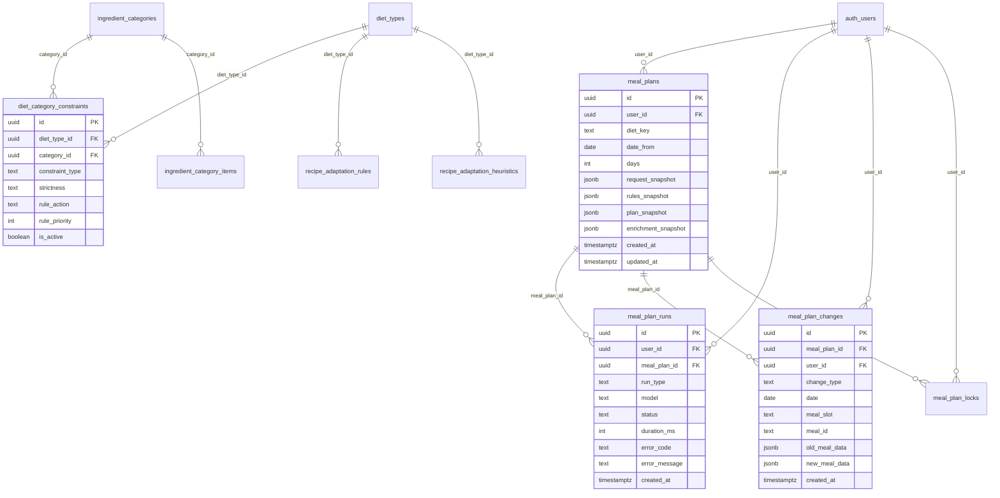

# Weekmenu v2 — Inventarisatie + Tech Doc

**Doel:** Actuele inventarisatie van het bestaande weekmenu/mealplan-domein en het guardrails (vNext) dieetmodel, als basis voor uitbreiding (scheduled generation + review flow).

**Scope:** Alleen inventarisatie + documentatie. Geen nieuwe DB, UI of job scheduler.

---

## 1) Huidige situatie — Samenvatting

- **Meal plans** worden opgeslagen als snapshots in `meal_plans`: `request_snapshot`, `rules_snapshot`, `plan_snapshot`, optioneel `enrichment_snapshot`. Geen genormaliseerde meal_slots-tabel; alles zit in JSONB.
- **Generatieflow:** Create → MealPlannerAgentService (generateMealPlan) → vNext guardrails check → bij blokkade retry met striktere prompt; daarna optioneel enrichment → insert `meal_plans` + log in `meal_plan_runs`.
- **Regeneratie:** Per plan of per dag; zelfde agent + guardrails; plan wordt geüpdatet in-place in `meal_plans`.
- **Plan chat:** Gebruiker stuurt bericht → PlanChatService (intent + edit) → vNext guardrails op de _aangepaste_ plan snapshot → bij ok: `applyPlanEdit` (meal_plan_changes + update plan_snapshot). Apply is **fail-closed** bij guardrails violation.
- **Guardrails vNext:** Eén ruleset-loader (DB: `diet_category_constraints` + `ingredient_category_items` + `recipe_adaptation_rules` + heuristics) → `GuardrailsRuleset` → evaluator (allow/block, strictness hard/soft, priority). Gebruikt in **meal_planner**, **plan_chat** en **recipe_adaptation** (recipe adaptation kan optioneel enforced worden via env).
- **RLS:** `meal_plans`, `meal_plan_runs`, `meal_plan_changes`, `meal_plan_locks` zijn user-scoped (`auth.uid() = user_id`). Guardrails-tabellen: public read (actieve regels), admin write. Geen service_role-bypass voor meal plans.
- **Observability:** `meal_plan_runs` logt elke generate/regenerate/enrich (run_type, status, duration_ms, error_code, error_message); immutable (geen UPDATE/DELETE policies). Runs-pagina toont runs voor de huidige user.

---

## 2) Gevonden bouwblokken

| Onderdeel                       | Bestandspad                                                                               | Rol                                                                                                                                                                    |
| ------------------------------- | ----------------------------------------------------------------------------------------- | ---------------------------------------------------------------------------------------------------------------------------------------------------------------------- |
| **DB: meal_plans**              | `supabase/migrations/20260124133841_meal_plans.sql`                                       | Tabel meal_plans (user_id, diet_key, date_from, days, request/rules/plan/enrichment snapshot JSONB). RLS: SELECT/INSERT/UPDATE/DELETE op eigen user.                   |
| **DB: meal_plan_runs**          | `supabase/migrations/20260124133842_meal_plan_runs.sql`                                   | Observability: user*id, meal_plan_id, run_type, model, status, duration_ms, error*\* . RLS: SELECT/INSERT eigen user; geen UPDATE/DELETE.                              |
| **DB: meal_plan_changes**       | `supabase/migrations/20260127000000_meal_plan_changes.sql`                                | Audit: meal_plan_id, user_id, change_type, date, meal_slot, meal_id, old/new_meal_data. RLS: SELECT/INSERT eigen user.                                                 |
| **DB: meal_plan_locks**         | `supabase/migrations/20260127000000_meal_plan_changes.sql`                                | Locks (bijv. producten gekocht): meal_plan_id, lock_type, date, meal_slot, meal_id, locked_ingredients. RLS: eigen user.                                               |
| **Types: meal plan**            | `src/lib/meal-plans/mealPlans.types.ts`                                                   | MealPlanRecord, CreateMealPlanInput, RegenerateMealPlanInput.                                                                                                          |
| **Types: diets (plan)**         | `src/lib/diets/diet.types.ts`                                                             | MealPlanRequest, MealPlanResponse, MealPlanDay, Meal, DietRuleSet, MealSlot, MealIngredientRef.                                                                        |
| **Service: meal plans**         | `src/lib/meal-plans/mealPlans.service.ts`                                                 | Create (idempotent), load, list, delete, regenerate (full/day), quota (10/hour). Gebruikt `.select('*')` op meal_plans en meal_plan_runs.                              |
| **Agent: meal planner**         | `src/lib/agents/meal-planner/mealPlannerAgent.service.ts`                                 | generateMealPlan, generateMealPlanDay; roept enforceVNextMealPlannerGuardrails na generatie.                                                                           |
| **Agent: plan chat**            | `src/lib/agents/meal-planner/planChat.service.ts`                                         | handleChat: intent → edit → vNext guardrails op plan+edit → applyPlanEdit. Apply geblokkeerd bij guardrails violation.                                                 |
| **Agent: plan edit apply**      | `src/lib/agents/meal-planner/planEdit.apply.ts`                                           | applyPlanEdit: schrijft meal_plan_changes + update meal_plans.plan_snapshot.                                                                                           |
| **Actions: meal plans**         | `src/app/(app)/meal-plans/actions/mealPlans.actions.ts`                                   | createMealPlanAction, regenerateMealPlanAction, listMealPlansAction, loadMealPlanAction, deleteMealPlanAction.                                                         |
| **Actions: plan edit**          | `src/app/(app)/meal-plans/[planId]/actions/planEdit.actions.ts`                           | applyDirectPlanEditAction, getActivePlanEditsAction.                                                                                                                   |
| **Actions: plan chat**          | `src/app/(app)/meal-plans/[planId]/chat/actions/planChat.actions.ts`                      | submitPlanChatMessageAction.                                                                                                                                           |
| **Actions: runs**               | `src/app/(app)/runs/actions/runs.actions.ts`                                              | listRunsAction (meal_plan_runs voor user). Gebruikt `.select('*')`.                                                                                                    |
| **Guardrails vNext: types**     | `src/lib/guardrails-vnext/types.ts`                                                       | RuleAction, Strictness, MatchTarget, MatchMode, GuardRule, GuardrailsRuleset, GuardDecision, EvaluationContext, GuardReasonCode, etc.                                  |
| **Guardrails vNext: loader**    | `src/lib/guardrails-vnext/ruleset-loader.ts`                                              | loadGuardrailsRuleset(dietId, mode), loadRulesetWithDietLogic; laadt uit diet_category_constraints + ingredient_category_items + recipe_adaptation_rules + heuristics. |
| **Guardrails vNext: evaluator** | `src/lib/guardrails-vnext/evaluator.ts`                                                   | evaluateGuardrails(input), sortRules; pure evaluator op targets (ingredient/step/metadata).                                                                            |
| **Guardrails vNext: adapters**  | `src/lib/guardrails-vnext/adapters/meal-planner.ts`, `plan-chat.ts`, `meal-to-targets.ts` | mapMealPlanToGuardrailsTargets, map voor plan_chat; mapMealToGuardrailsTargets voor recepten.                                                                          |
| **DB: guardrails**              | `supabase/migrations/20260131000006_ingredient_categories.sql`                            | ingredient_categories, ingredient_category_items, diet_category_constraints (constraint_type, strictness, rule_priority na firewall migration).                        |
| **DB: firewall rules**          | `supabase/migrations/20260131000007_firewall_rules.sql`                                   | rule_action (allow/block), rule_priority op diet_category_constraints.                                                                                                 |
| **DB: recipe adaptation rules** | `supabase/migrations/20260131000005_recipe_adaptation_rules.sql`                          | recipe_adaptation_rules, recipe_adaptation_heuristics. RLS: public read actief, admin write.                                                                           |
| **UI: meal plans list**         | `src/app/(app)/meal-plans/page.tsx`, `MealPlansTable.tsx`                                 | Server: listMealPlansAction. Client: tabel met plans.                                                                                                                  |
| **UI: meal plan detail**        | `src/app/(app)/meal-plans/[planId]/page.tsx`                                              | Server: loadMealPlanAction(planId). MealPlanSummary, MealPlanActionsClient, MealPlanPageWrapper.                                                                       |
| **UI: new plan**                | `src/app/(app)/meal-plans/new/page.tsx`, `CreateMealPlanForm.tsx`                         | createMealPlanAction → redirect naar /meal-plans/[planId]. GuardrailsViolationEmptyState.                                                                              |
| **UI: plan chat**               | `src/app/(app)/meal-plans/[planId]/chat/page.tsx`, `PlanChatClient.tsx`                   | submitPlanChatMessageAction, GuardrailsViolationMessage.                                                                                                               |
| **UI: runs**                    | `src/app/(app)/runs/`                                                                     | listRunsAction, RunsTable (run_type, status, duration, error, link naar plan).                                                                                         |

---

## 3) GuardRails / Dieetregels model

### Bronnen (DB)

- **diet_category_constraints** (`20260131000006`, `20260131000007`): koppelt diet_type ↔ ingredient_category. Velden: constraint_type (forbidden/required), strictness (hard/soft), rule_action (allow/block), rule_priority, min_per_day/week, is_active.
- **ingredient_categories** / **ingredient_category_items**: categorieën (forbidden/required) en items (term, term_nl, synonyms).
- **recipe_adaptation_rules**: term, synonyms, rule_code, rule_label, substitution_suggestions, priority, target, match_mode (in latere migration), is_active.
- **recipe_adaptation_heuristics**: heuristic_type, terms (bijv. added_sugar).

### vNext type-model (code)

- **RuleAction:** `allow` | `block` (firewall: block wint op allow).
- **Strictness:** `hard` (blokkeer output) | `soft` (alleen waarschuwing).
- **MatchTarget:** ingredient | step | metadata.
- **MatchMode:** exact | word_boundary | substring | canonical_id.
- **GuardRule:** id, action, strictness, priority, target, match { term, synonyms?, canonicalId?, preferredMatchMode? }, metadata (ruleCode, label, category, specificity), remediation?.
- **GuardrailsRuleset:** dietId/dietKey, version, rules[], heuristics?, provenance, contentHash.
- **GuardDecision:** ok, outcome (allowed|blocked|warned), matches, appliedRuleIds, summary, reasonCodes, remediationHints, trace.

### Enforcement points

- **Meal planner:** Na elke generatie (full plan of day) in `MealPlannerAgentService.enforceVNextMealPlannerGuardrails` — plan wordt geblokkeerd of retry. Zie `src/lib/agents/meal-planner/mealPlannerAgent.service.ts`.
- **Plan chat apply:** Voor apply in `PlanChatService`: guardrails + optioneel Diet Logic op plan+edit; bij !decision.ok → AppError GUARDRAILS_VIOLATION, apply wordt niet uitgevoerd. Zie `src/lib/agents/meal-planner/planChat.service.ts`.
- **Recipe adaptation:** In `recipe-adaptation.service.ts` shadow mode (USE_VNEXT_GUARDRAILS); in `recipe-ai.persist.actions.ts` optioneel enforce (ENFORCE_VNEXT_GUARDRAILS_RECIPE_ADAPTATION) bij apply — blokkeert persist bij hard violations.

### RLS guardrails-tabellen

- **diet_category_constraints, ingredient_categories, ingredient_category_items:** Public SELECT met `is_active = true`; admin voor INSERT/UPDATE/DELETE (o.a. `public.is_admin(auth.uid())`).
- **recipe_adaptation_rules / recipe_adaptation_heuristics:** Zelfde patroon (actief lezen, admin schrijven). Geen bypass voor gewone users.

---

## 4) Herbruikbaar voor v2

- **Planstructuur:** `MealPlanResponse` (days[].meals[], ingredientRefs) en `MealPlanRecord` (snapshots) zijn direct bruikbaar voor “draft” en “applied” plan; geen aparte draft-tabel nodig indien we draft als apart plan (of veld) modelleren.
- **Adaptation draft → review → apply:** Recepten gebruiken `recipe_adaptations` + `recipe_adaptation_runs`; meal plan heeft geen aparte “draft”-entiteit — wijzigingen gaan via plan_chat/plan edit direct naar plan_snapshot + meal_plan_changes. Voor v2 “draft → review → apply” kan hetzelfde patroon als recepten worden geïntroduceerd (bijv. draft_plan_snapshot kolom of aparte draft-plannen met status).
- **Guardrails:** Zelfde `loadGuardrailsRuleset` / `evaluateGuardrails` en adapters (`mapMealPlanToGuardrailsTargets`) zijn herbruikbaar voor scheduled jobs en voor “review”-stap (evalueer draft tegen actieve ruleset).
- **Runs/audit:** `meal_plan_runs` is geschikt voor job/run logging (run_type uitbreiden met bijv. `scheduled_generate`); zelfde RLS (user_id). Geen aparte “job”-tabel aangetroffen; die zou nieuw zijn (out of scope).
- **Diet rules snapshot:** `rules_snapshot` (DietRuleSet) in meal_plans is al aanwezig; handig voor repro en audit van welke regels golden bij generatie.

---

## 5) Mermaid-diagram

### ERD (belangrijkste tabellen)

### Sequence: weekmenu laden + bewerken (plan chat apply)

---

## 6) Open vragen / Gaps

- **SELECT \*:** `MealPlansService` en `runs.actions` gebruiken `.select('*')` op `meal_plans` en `meal_plan_runs`. Minimal columns is niet doorgevoerd; aan te bevelen voor v2 om expliciet kolommen te selecteren.
- **Job/scheduler-tabel:** Geen tabel voor “scheduled weekmenu job” of cron-metadata aangetroffen; valt buiten huidige scope.
- **Draft-entiteit meal plan:** Er is geen aparte draft-entity voor meal plan (zoals recipe_adaptations voor recepten). Wijzigingen gaan direct naar plan_snapshot + meal_plan_changes. Voor “draft → review → apply” moet worden beslist: aparte kolom (draft_snapshot), status op plan, of aparte draft-plannen.
- **compileConstraintsForAI:** In `src/lib/guardrails-vnext/index.ts` gedeclareerd maar nog niet geïmplementeerd (“Not implemented yet”); alleen evaluator + loader zijn in gebruik.
- **Diet Logic (4-phase):** `loadRulesetWithDietLogic` en Diet Logic evaluatie worden in plan_chat gebruikt; documentatie over DROP/FORCE/LIMIT/PASS staat in `docs/diet-logic-plan.md` — niet in dit document uitgeplozen.
- **RLS bypasses:** Geen service_role of andere RLS-bypass voor meal_plans/meal_plan_runs aangetroffen in de gevonden bouwblokken; alle toegang via `createClient()` (user context).
