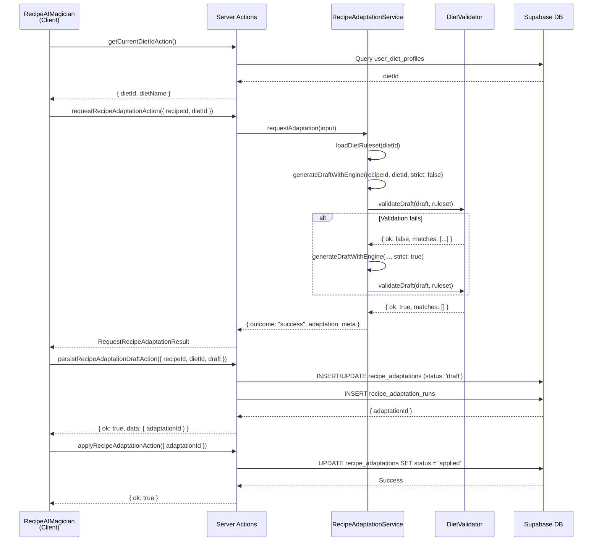

# Recipe Adaptation AI - Technische Documentatie

## Overzicht

De Recipe Adaptation AI feature maakt het mogelijk om bestaande recepten automatisch aan te passen aan de dieetvoorkeuren van de gebruiker. Het systeem analyseert een recept, identificeert ingrediënten die niet voldoen aan het dieet, en genereert een aangepaste versie met alternatieven.

### Terminologie

- **Original Recipe**: Het originele recept zoals het in de database staat (uit `custom_meals` of `meal_history`)
- **Adaptation**: Een aangepaste versie van het recept, opgeslagen in `recipe_adaptations` met status:
  - `draft`: Conceptversie, nog niet toegepast
  - `applied`: Actieve aangepaste versie
  - `archived`: Oude versie, niet meer actief
- **Run / Audit Trail**: Een record in `recipe_adaptation_runs` die een volledige AI-run documenteert (input, output, validatie, outcome)

## End-to-End Flow

### Happy Path

1. **User opent Recipe detail pagina** → Ziet "AI Magician" button
2. **Klikt "AI Magician"** → Dialog opent met idle state
3. **Klikt "Start analyse"** →
   - `getCurrentDietIdAction()` haalt actief dieet op
   - `requestRecipeAdaptationAction({ recipeId, dietId })` wordt aangeroepen
4. **Service laag**:
   - `RecipeAdaptationService.requestAdaptation()` normaliseert input
   - `loadDietRuleset()` laadt dieetregels (stub: hardcoded)
   - `generateDraftWithEngine()` genereert draft (stub: mock data)
   - `validateDraft()` valideert tegen dieetregels
   - Bij validatiefout: retry met `strict: true` (max 1 retry)
5. **Persist draft**:
   - `persistRecipeAdaptationDraftAction()` wordt automatisch aangeroepen
   - Maakt/update `recipe_adaptations` record (status: 'draft')
   - Maakt `recipe_adaptation_runs` record voor audit trail
6. **User ziet resultaat**:
   - Tab "Analyse": lijst met violations + suggesties
   - Tab "Aangepaste versie": aangepaste ingrediënten + stappen
   - "Apply" knop wordt enabled
7. **User klikt "Apply"**:
   - `applyRecipeAdaptationAction({ adaptationId })` wordt aangeroepen
   - Status wordt geupdate naar 'applied'
   - UI toont confirmation state

### Sequence Diagram



## Contracts (TypeScript)

### RequestRecipeAdaptationInput

```typescript
type RequestRecipeAdaptationInput = {
  recipeId: string; // Required: UUID of recipe (custom_meals.id or meal_history.id)
  dietId?: string; // Optional: Diet ID (if missing → outcome "empty")
  locale?: string; // Optional: For future i18n support
};
```

### RequestRecipeAdaptationResult

Discriminated union op `outcome`:

```typescript
type RequestRecipeAdaptationResult =
  | {
      outcome: 'success';
      adaptation: RecipeAdaptationDraft;
      meta: AdaptationMeta;
    }
  | {
      outcome: 'empty';
      reason: 'NO_DIET_SELECTED';
    }
  | {
      outcome: 'error';
      message: string;
      code: 'INVALID_INPUT' | 'INTERNAL_ERROR';
    };
```

### RecipeAdaptationDraft

```typescript
type RecipeAdaptationDraft = {
  analysis: {
    violations: ViolationDetail[];
    summary: string;
  };
  rewrite: {
    title: string;
    ingredients: IngredientLine[];
    steps: StepLine[];
  };
  confidence?: number; // 0.0 - 1.0
  openQuestions?: string[]; // Optional questions for user
};
```

### Voorbeeld Payloads

#### Success Response

```json
{
  "outcome": "success",
  "adaptation": {
    "analysis": {
      "violations": [
        {
          "ingredientName": "Melk",
          "ruleCode": "LACTOSE_FREE",
          "ruleLabel": "Lactose-intolerantie",
          "suggestion": "Vervang door amandelmelk of havermelk"
        }
      ],
      "summary": "1 ingrediënt wijkt af van je dieetvoorkeuren."
    },
    "rewrite": {
      "title": "Aangepast recept",
      "ingredients": [
        { "name": "Amandelmelk", "quantity": "250", "unit": "ml" }
      ],
      "steps": [{ "step": 1, "text": "Verwarm de oven voor op 180°C." }]
    },
    "confidence": 0.85
  },
  "meta": {
    "timestamp": "2026-01-31T10:00:00Z",
    "recipeId": "abc-123",
    "dietId": "diet-456"
  }
}
```

#### Empty Response

```json
{
  "outcome": "empty",
  "reason": "NO_DIET_SELECTED"
}
```

#### Error Response

```json
{
  "outcome": "error",
  "message": "Recept ID is vereist",
  "code": "INVALID_INPUT"
}
```

## Server Actions

### requestRecipeAdaptationAction

**Locatie**: `src/app/(app)/recipes/[recipeId]/actions/recipe-ai.actions.ts`

**Verantwoordelijkheid**:

- Valideert input met Zod schema
- Roept `RecipeAdaptationService` aan
- Retourneert discriminated union result

**Input**: `{ recipeId: string, dietId?: string, locale?: string }`

**Output**: `RequestRecipeAdaptationResult`

**Error Codes**:

- `INVALID_INPUT`: recipeId ontbreekt of ongeldig
- `INTERNAL_ERROR`: Onverwachte fout in service

**Idempotency**:

- Herhaalde calls metzelfde input kunnen verschillende drafts genereren (engine is non-deterministic)
- Elke call maakt een nieuwe run record

### getCurrentDietIdAction

**Locatie**: `src/app/(app)/recipes/[recipeId]/actions/recipe-ai.persist.actions.ts`

**Verantwoordelijkheid**:

- Haalt actief dieetprofiel op voor ingelogde user
- Query: `user_diet_profiles` waar `ends_on IS NULL`

**Output**: `ActionResult<{ dietId: string, dietName: string } | null>`

**Error Codes**:

- `AUTH_ERROR`: User niet ingelogd
- `DB_ERROR`: Database fout

### persistRecipeAdaptationDraftAction

**Locatie**: `src/app/(app)/recipes/[recipeId]/actions/recipe-ai.persist.actions.ts`

**Verantwoordelijkheid**:

- Persisteert draft naar `recipe_adaptations` (upsert op user_id + recipe_id + diet_id)
- Maakt audit trail record in `recipe_adaptation_runs`
- Status wordt gezet op 'draft'

**Input**:

```typescript
{
  recipeId: string;
  dietId: string;
  draft: RecipeAdaptationDraft;
  validationReport?: ValidationReport;
  meta?: { timestamp?: string; locale?: string };
}
```

**Output**: `ActionResult<{ adaptationId: string }>`

**Error Codes**:

- `AUTH_ERROR`: User niet ingelogd
- `VALIDATION_ERROR`: Ontbrekende required fields
- `DB_ERROR`: Database fout bij insert/update

**Idempotency**:

- Upsert: als adaptation al bestaat (user_id + recipe_id + diet_id), wordt deze geupdate
- Elke persist call maakt een nieuwe run record (niet idempotent voor runs)

### applyRecipeAdaptationAction

**Locatie**: `src/app/(app)/recipes/[recipeId]/actions/recipe-ai.persist.actions.ts`

**Verantwoordelijkheid**:

- Update status van adaptation naar 'applied'
- Verifieert ownership via RLS + service check

**Input**: `{ adaptationId: string }`

**Output**: `ActionResult<void>`

**Error Codes**:

- `AUTH_ERROR`: User niet ingelogd
- `VALIDATION_ERROR`: adaptationId ontbreekt
- `DB_ERROR`: Database fout of ownership check faalt

**Idempotency**:

- Idempotent: meerdere calls metzelfde adaptationId zijn veilig (status blijft 'applied')

## Service Layer & Validator

### RecipeAdaptationService

**Locatie**: `src/app/(app)/recipes/[recipeId]/services/recipe-adaptation.service.ts`

**Kernmethoden**:

#### requestAdaptation(input)

Orchestreert het volledige adaptation proces:

1. Normaliseert input (recipeId, dietId)
2. Laadt diet ruleset
3. Genereert draft via engine
4. Valideert draft
5. Retry met strict mode indien nodig (max 1 retry)
6. Retourneert result

#### generateDraftWithEngine(recipeId, dietId, strict)

**Stub implementatie** (wordt later vervangen door echte AI provider):

- `strict: false`: Kan verboden ingrediënten bevatten (voor testen retry)
- `strict: true`: Bevat geen verboden ingrediënten
- Simuleert 400-800ms latency

**Toekomstige implementatie**:

- Roept AI provider aan (Gemini/OpenAI/etc.)
- Gebruikt prompt met dieetregels
- Structured output met schema validatie

#### Retry Policy

- **Max 1 retry**: Als eerste draft validatie faalt, wordt `generateDraftWithEngine(..., strict: true)` aangeroepen
- **Strict mode**: Engine krijgt extra instructies om verboden ingrediënten te vermijden
- **Na retry nog steeds fout**: Retourneert `outcome: "error"` met code `INTERNAL_ERROR`

### DietValidator

**Locatie**: `src/app/(app)/recipes/[recipeId]/services/diet-validator.ts`

#### DietRuleset Type

```typescript
type DietRuleset = {
  dietId: string;
  version: number;
  forbidden: Array<{
    term: string;
    synonyms?: string[];
    ruleCode: string;
    ruleLabel: string;
    substitutionSuggestions?: string[];
  }>;
  heuristics?: {
    addedSugarTerms: string[];
  };
};
```

#### validateDraft(draft, ruleset)

**Functionaliteit**:

- Scant `draft.rewrite.ingredients[].name` en `draft.rewrite.steps[].text`
- Word boundary matching (case-insensitive)
- Synonym matching
- Added sugar heuristiek (alleen in steps)

**ValidationReport**:

```typescript
type ValidationReport = {
  ok: boolean;
  matches: Array<{
    term: string;
    matched: string;
    where: 'ingredients' | 'steps';
  }>;
  summary: string;
};
```

**Bekende beperkingen**:

- **False positives**: Woorden zoals "suikervrij" kunnen matchen op "suiker" (word boundary helpt maar is niet perfect)
- **Heuristieken**: Added sugar detection is gebaseerd op woordenlijst, geen deep analysis
- **Synonyms**: Moeten handmatig worden onderhouden in ruleset

## Database & RLS (Supabase)

### Tabel: recipe_adaptations

**Locatie**: `supabase/migrations/20260131000004_recipe_adaptations.sql`

**Kolommen**:

- `id` (UUID, PK)
- `user_id` (UUID, FK → auth.users, CASCADE DELETE)
- `recipe_id` (TEXT, NOT NULL) - **Geen FK**: flexibiliteit voor custom_meals/meal_history/externe IDs
- `diet_id` (TEXT, NOT NULL) - Diet identifier (geïndexeerd)
- `diet_ruleset_version` (INTEGER, DEFAULT 1) - Voor toekomstige versioning
- `status` (TEXT, CHECK: 'draft' | 'applied' | 'archived')
- `title` (TEXT, NOT NULL)
- `analysis_summary` (TEXT, NULL)
- `analysis_violations` (JSONB, DEFAULT '[]')
- `rewrite_ingredients` (JSONB, DEFAULT '[]')
- `rewrite_steps` (JSONB, DEFAULT '[]')
- `nutrition_estimate` (JSONB, NULL) - Voor toekomstige nutrition berekeningen
- `confidence` (NUMERIC(5,2), NULL) - 0.00 tot 1.00
- `open_questions` (JSONB, DEFAULT '[]')
- `created_at`, `updated_at` (TIMESTAMPTZ)

**Indexes**:

- `(user_id, recipe_id, diet_id)` - Voor lookup van bestaande adaptations
- `(user_id, status)` - Voor filtering op status
- Individuele indexes op `recipe_id`, `diet_id`, `created_at`

**Opmerking recipe_id als TEXT**:

- Bewuste keuze: kan verwijzen naar `custom_meals.id`, `meal_history.id`, of externe recipe IDs
- Geen FK constraint: voorkomt dependency issues bij recipe deletion
- Trade-off: geen automatische cascade delete, maar wel flexibiliteit

### Tabel: recipe_adaptation_runs

**Kolommen**:

- `id` (UUID, PK)
- `recipe_adaptation_id` (UUID, FK → recipe_adaptations, CASCADE DELETE)
- `model` (TEXT, NULL) - AI model naam (bijv. "gemini-2.0-flash-exp")
- `prompt_version` (INTEGER, DEFAULT 1)
- `input_snapshot` (JSONB, NOT NULL) - RequestRecipeAdaptationInput snapshot
- `output_snapshot` (JSONB, NOT NULL) - RecipeAdaptationDraft snapshot
- `validation_report` (JSONB, NOT NULL) - ValidationReport snapshot
- `outcome` (TEXT, CHECK: 'success' | 'needs_retry' | 'failed')
- `tokens_in`, `tokens_out` (INTEGER, NULL) - Voor cost tracking
- `latency_ms` (INTEGER, NULL) - Voor performance monitoring
- `created_at` (TIMESTAMPTZ)

**Indexes**:

- `(recipe_adaptation_id, created_at DESC)` - Voor audit trail chronologie
- Individuele indexes op `outcome`, `created_at`

**Immutability**:

- Runs zijn immutable: geen UPDATE/DELETE policies
- Alleen SELECT en INSERT toegestaan
- CASCADE DELETE: als adaptation wordt verwijderd, worden runs ook verwijderd

### RLS Policies

**recipe_adaptations**:

- **SELECT**: `auth.uid() = user_id` - Users zien alleen eigen adaptations
- **INSERT**: `auth.uid() = user_id` - Users kunnen alleen eigen adaptations aanmaken
- **UPDATE**: `auth.uid() = user_id` (zowel USING als WITH CHECK) - Users kunnen alleen eigen adaptations updaten
- **DELETE**: `auth.uid() = user_id` - Users kunnen alleen eigen adaptations verwijderen

**recipe_adaptation_runs**:

- **SELECT**: EXISTS check via `recipe_adaptations.user_id = auth.uid()` - Users zien runs voor eigen adaptations
- **INSERT**: EXISTS check - Users kunnen runs aanmaken voor eigen adaptations
- **UPDATE/DELETE**: Geen policies - Runs zijn immutable

**Security Notes**:

- RLS is leidend: zelfs met service role client moet RLS correct zijn
- Server actions gebruiken authenticated Supabase client (niet service role)
- Alle queries respecteren automatisch RLS policies

## UI/UX States

### RecipeAIMagician Component States

**Locatie**: `src/app/(app)/recipes/[recipeId]/components/RecipeAIMagician.tsx`

#### Main States (RecipeAIState)

- **idle**: Initial state, toont uitleg + "Start analyse" button
- **loading**: Analyse bezig, toont spinner + skeleton
- **error**: Fout opgetreden, toont error message + retry button
- **empty**: Geen dieet geselecteerd, toont melding
- **success**: Analyse succesvol, toont violations + rewrite preview

#### Persist States

- **isPersisting**: Boolean, true tijdens persist operatie
- **persistError**: String | null, error message als persist faalt
- **adaptationId**: String | null, ID van opgeslagen adaptation

#### Apply States

- **isApplying**: Boolean, true tijdens apply operatie
- **isApplied**: Boolean, true na succesvolle apply
- **applyError**: String | null, error message als apply faalt

### "Apply" Button Logic

**Enabled wanneer**:

- `state.type === "success"` EN
- `adaptationId !== null` EN
- `!isApplying` EN
- `!isPersisting` EN
- `!isApplied`

**Disabled wanneer**:

- Analyse nog niet succesvol
- Adaptation nog niet opgeslagen
- Apply operatie bezig
- Al toegepast

### Error Handling in UI

**Persist failures**:

- Non-blocking: toont inline amber alert
- Preview blijft zichtbaar
- User kan alsnog "Apply" proberen (maar zal falen zonder adaptationId)

**Apply failures**:

- Inline red error message
- Button blijft enabled voor retry
- User kan opnieuw proberen

## Observability & Troubleshooting

### Veelvoorkomende Issues

#### "No diet selected" (Empty State)

**Symptoom**: UI toont "Geen dieet geselecteerd" message

**Checks**:

1. Verifieer `getCurrentDietIdAction()` response:
   ```typescript
   const result = await getCurrentDietIdAction();
   // Check: result.ok && result.data !== null
   ```
2. Check database:
   ```sql
   SELECT * FROM user_diet_profiles
   WHERE user_id = '<user_id>'
   AND ends_on IS NULL;
   ```
3. Als geen profiel: user moet onboarding voltooien

**Oplossing**: User moet actief dieetprofiel hebben in `user_diet_profiles`

#### Persist faalt

**Symptoom**: `persistError` wordt getoond in UI

**Checks**:

1. **Auth context**: Verifieer dat user ingelogd is
   ```sql
   SELECT auth.uid(); -- In Supabase SQL editor
   ```
2. **RLS policies**: Test of policies correct zijn
   ```sql
   -- Als service role: disable RLS tijdelijk om te testen
   SET ROLE service_role;
   SELECT * FROM recipe_adaptations WHERE user_id = '<user_id>';
   ```
3. **Database constraints**: Check of required fields aanwezig zijn
   ```sql
   -- Check voor NULL values in required fields
   SELECT * FROM recipe_adaptations
   WHERE user_id IS NULL OR recipe_id IS NULL OR diet_id IS NULL;
   ```

**Oplossing**:

- Als auth issue: verifieer Supabase client configuratie
- Als RLS issue: check policy definities in migration
- Als constraint issue: check input validatie in server action

#### Apply faalt

**Symptoom**: `applyError` wordt getoond, status blijft 'draft'

**Checks**:

1. **Ownership**: Verifieer dat adaptation bij user hoort
   ```sql
   SELECT id, user_id, status
   FROM recipe_adaptations
   WHERE id = '<adaptation_id>';
   ```
2. **RLS**: Test update policy
   ```sql
   -- Als service role: test update
   UPDATE recipe_adaptations
   SET status = 'applied'
   WHERE id = '<adaptation_id>' AND user_id = '<user_id>';
   ```
3. **AdaptationId**: Verifieer dat `adaptationId` niet null is in UI state

**Oplossing**:

- Als ownership issue: check `RecipeAdaptationDbService.updateStatus()` implementatie
- Als RLS issue: verifieer UPDATE policy
- Als adaptationId null: check persist flow

#### Validator blijft falen

**Symptoom**: Retry faalt ook, outcome blijft "error"

**Checks**:

1. **Ruleset**: Verifieer dat ruleset correct is geladen
   ```typescript
   // In RecipeAdaptationService.loadDietRuleset()
   console.log('Ruleset:', ruleset);
   ```
2. **Draft output**: Check wat engine genereert
   ```typescript
   // In generateDraftWithEngine()
   console.log('Draft:', draft);
   ```
3. **Validation matches**: Check welke matches worden gevonden
   ```typescript
   const report = validateDraft(draft, ruleset);
   console.log('Validation report:', report);
   ```

**Oplossing**:

- Als ruleset issue: update `loadDietRuleset()` met correcte regels
- Als engine issue: update `generateDraftWithEngine()` stub
- Als validator issue: check word boundary matching logic

### SQL Snippets voor Inspectie

#### Adaptations per User

```sql
SELECT
  id,
  recipe_id,
  diet_id,
  status,
  title,
  confidence,
  created_at,
  updated_at
FROM recipe_adaptations
WHERE user_id = '<user_id>'
ORDER BY created_at DESC;
```

#### Runs per Adaptation

```sql
SELECT
  id,
  outcome,
  model,
  latency_ms,
  tokens_in,
  tokens_out,
  created_at
FROM recipe_adaptation_runs
WHERE recipe_adaptation_id = '<adaptation_id>'
ORDER BY created_at DESC;
```

#### Adaptations met Meeste Runs

```sql
SELECT
  ra.id,
  ra.title,
  ra.status,
  COUNT(rar.id) as run_count
FROM recipe_adaptations ra
LEFT JOIN recipe_adaptation_runs rar ON ra.id = rar.recipe_adaptation_id
WHERE ra.user_id = '<user_id>'
GROUP BY ra.id, ra.title, ra.status
ORDER BY run_count DESC;
```

### Logging

**Server-side logs** (geen PII):

- `console.error()` in server actions voor errors
- `console.log()` in services voor debugging (alleen development)
- Geen user emails, recipe names, of andere PII in logs

**Log locations**:

- Server actions: `src/app/(app)/recipes/[recipeId]/actions/*.actions.ts`
- Services: `src/app/(app)/recipes/[recipeId]/services/*.service.ts`

**Voorbeeld log output**:

```
Error in requestRecipeAdaptationAction: Error: Dieet met ID "xyz" niet gevonden
Error in RecipeAdaptationService.requestAdaptation: Validation failed after retry
```

## Extensiepunten (Roadmap)

### 1. Echte AI Provider Integratie

**Waar**: `RecipeAdaptationService.generateDraftWithEngine()`

**Huidige implementatie**: Stub met mock data

**Toekomstige implementatie**:

```typescript
private async generateDraftWithEngine(
  recipeId: string,
  dietId: string,
  strict: boolean
): Promise<RecipeAdaptationDraft> {
  // 1. Load original recipe from database
  // 2. Load diet ruleset
  // 3. Build prompt with recipe + rules
  // 4. Call Gemini/OpenAI with structured output schema
  // 5. Validate response against RecipeAdaptationDraft schema
  // 6. Return validated draft
}
```

**Aandachtspunten**:

- Gebruik structured output (Zod schema → JSON schema)
- Implementeer repair loop (zoals in meal planner)
- Log tokens/latency voor cost tracking
- Handle rate limits en retries

### 2. DietRuleset Versioning

**Huidige implementatie**: `diet_ruleset_version` kolom bestaat maar wordt niet gebruikt

**Toekomstige implementatie**:

- Load ruleset versie uit database/config
- Support meerdere versies per diet
- Migration path voor oude adaptations naar nieuwe versie
- Version comparison in UI ("This adaptation uses ruleset v1, new version available")

### 3. Rollback/Archiveren

**Huidige implementatie**: Status 'archived' bestaat maar geen UI/flow

**Toekomstige implementatie**:

- "Archive" action in UI
- "Restore" action om archived → draft/applied te zetten
- History view van alle adaptations (inclusief archived)
- Auto-archive oude applied adaptations bij nieuwe apply

### 4. Manual Edit UI + Re-validate

**Huidige implementatie**: Geen edit mogelijkheid

**Toekomstige implementatie**:

- Edit ingredients/steps in UI
- Re-validate na edit
- Save als nieuwe draft versie
- Diff view: wat is gewijzigd t.o.v. origineel

### 5. Nutrition Estimate Pipeline

**Huidige implementatie**: `nutrition_estimate` kolom bestaat maar is NULL

**Toekomstige implementatie**:

- Bereken nutrition uit aangepaste ingrediënten (via NEVO codes)
- Vergelijk met origineel recept
- Toon diff in UI ("-50 kcal, +10g eiwit")
- Optioneel: target-based suggestions ("Verhoog eiwit naar 30g")

## Bestandsstructuur

```
src/app/(app)/recipes/[recipeId]/
├── actions/
│   ├── recipe-ai.actions.ts          # requestRecipeAdaptationAction
│   └── recipe-ai.persist.actions.ts  # persist, apply, getDietId
├── components/
│   └── RecipeAIMagician.tsx           # UI component
├── services/
│   ├── recipe-adaptation.service.ts  # Main service (engine + validator orchestration)
│   ├── recipe-adaptation-db.service.ts # Database operations
│   └── diet-validator.ts             # Validation logic
└── recipe-ai.types.ts                # TypeScript contracts

supabase/migrations/
└── 20260131000004_recipe_adaptations.sql  # Database schema
```

## Referenties

- **Meal Planner Agent Docs**: `/docs/meal-planner-agent.md` - Voor AI provider patterns
- **Onboarding Flow**: `/docs/onboarding-flow.md` - Voor diet profile structuur
- **Catalyst UI Kit**: https://catalyst.tailwindui.com/docs - Voor UI componenten
- **Supabase RLS**: https://supabase.com/docs/guides/auth/row-level-security - Voor security patterns
